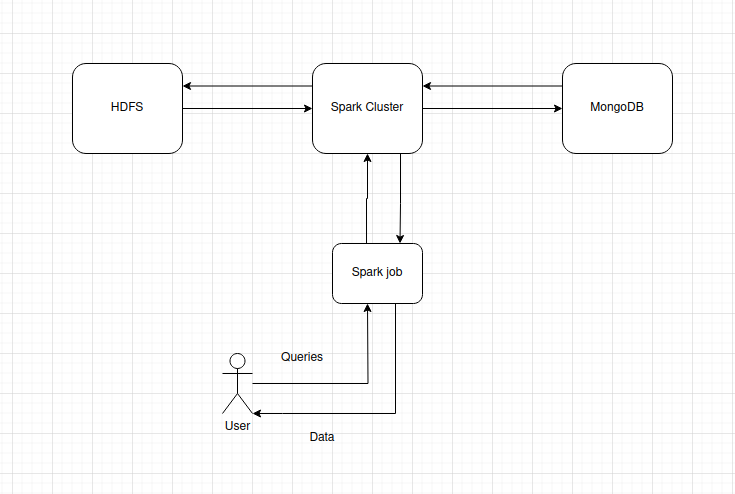

# Laboratório 8: PySpark e PyMongo

## Motivação

A infraestrutura que estamos desenvolvendo é projetada para lidar com grandes volumes de dados, conhecidos como Big Data, provenientes do arquivo de entrada fornecido pelo professor. A ideia é criar um sistema que possa processar e armazenar grandes quantidades de dados de forma eficiente e escalável, utilizando técnicas de processamento de dados em paralelo e armazenamento de dados distribuído.

## Problema

Se copiarmos os dados do HDFS para um nó de computador que está executando o MongoDB e rodarmos o script fora do Spark, podemos enfrentar problemas de desempenho e escalabilidade devido à limitação de recursos do nó. Isso pode resultar em erros de execução, perda de dados e uma execução lenta do sistema.

## Solução

Usar o Spark para processar os dados do HDFS e carregar no MongoDB é uma abordagem mais segura e escalável. O Spark pode processar os dados de forma distribuída em vários nós do cluster, utilizando técnicas de processamento de dados em paralelo, como o MapReduce, e armazenar os dados em um banco de dados NoSQL, como o MongoDB, que é projetado para lidar com grandes volumes de dados.

## Diagrama da Infraestrutura

## Consultas de Exemplo

Aqui estão 6 consultas de exemplo que podemos fazer com essa infraestrutura, relacionadas aos dados fornecidos pelo professor:

1. Quantos alunos ingressaram por meio do SiSU em um determinado período?
2. Qual é a distribuição de idade dos alunos que ingressaram por meio do SiSU?
3. Quais são os 5 cursos mais populares entre os alunos que ingressaram por meio do SiSU?
4. Qual é o número de alunos que ingressaram por meio do SiSU em um determinado curso?
5. Qual é a distribuição de sexo dos alunos que ingressaram por meio do SiSU?
6. Quais são os 5 cursos que mais receberam alunos por meio do SiSU em um determinado período?

Essas consultas podem ser realizadas utilizando técnicas de processamento de dados em paralelo e armazenamento de dados distribuído, o que permite uma execução mais rápida e eficiente dos dados.

